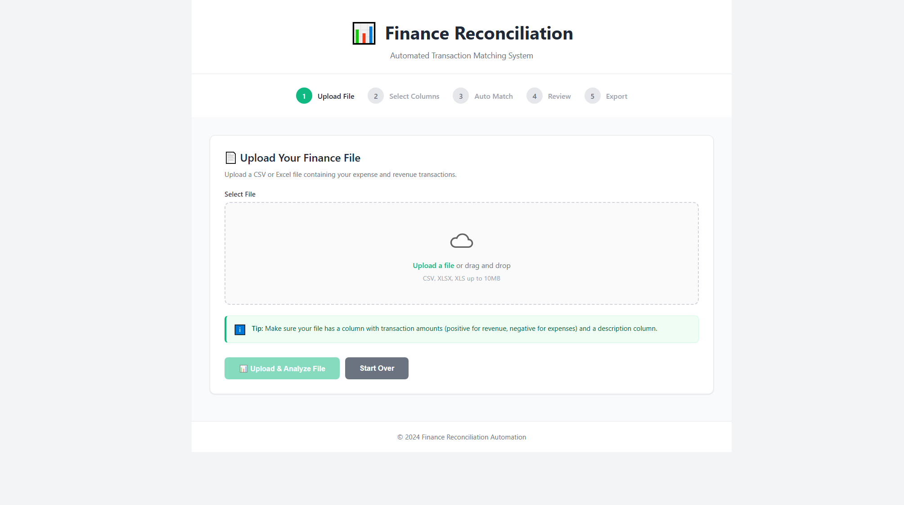
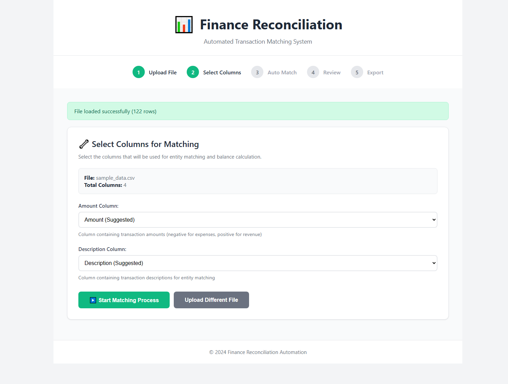
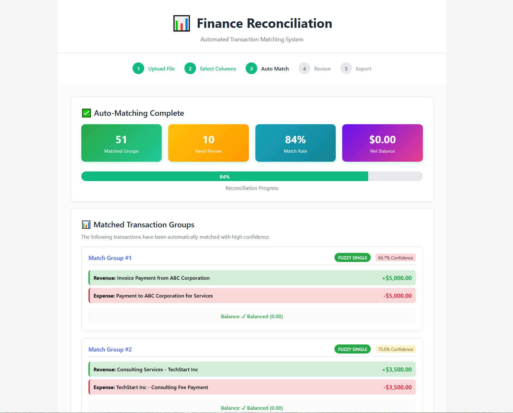
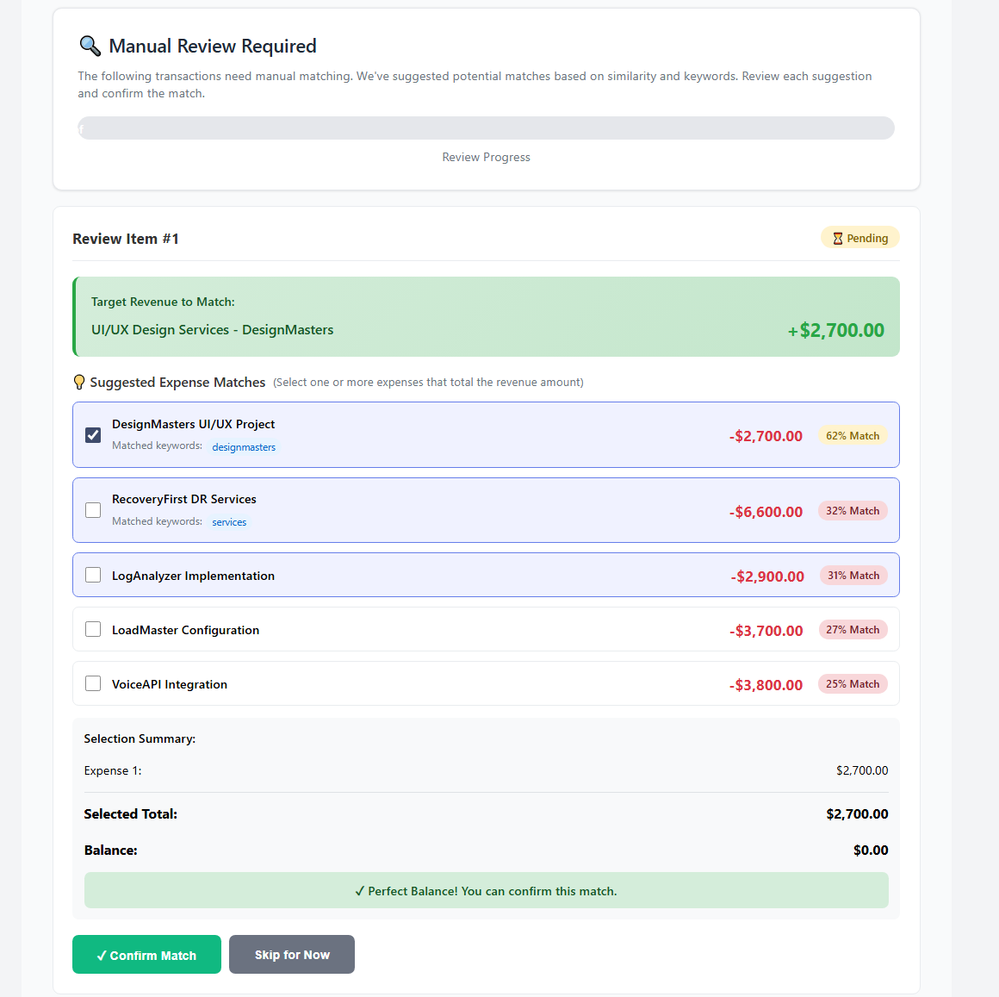
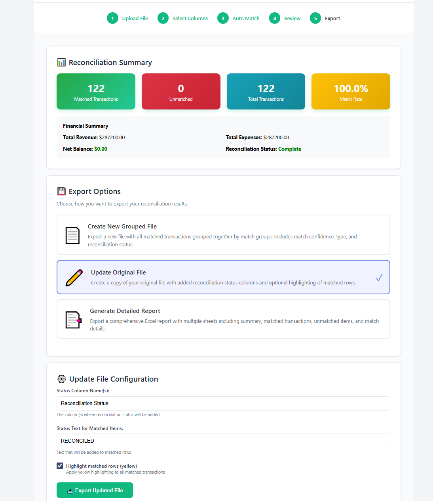

# 💰 Finance Reconciliation Automation

A powerful Python-based web application that automates the finance reconciliation process by intelligently matching expenses and revenues to achieve balanced transactions.


## 📋 Table of Contents

- [Overview](#overview)
- [Features](#features)
- [Installation](#installation)
- [Usage Guide](#usage-guide)
- [Project Structure](#project-structure)
- [How It Works](#how-it-works)
- [Matching Algorithms](#matching-algorithms)
- [Export Options](#export-options)
- [Troubleshooting](#troubleshooting)
- [Contributing](#contributing)

## 🎯 Overview

Finance Reconciliation Automation streamlines the tedious process of matching financial transactions. It automatically identifies and groups related expenses and revenues, helping you achieve balanced accounts quickly and accurately.

## 📸 Screenshots

### Upload Interface

*Modern, clean interface with drag-and-drop file upload functionality*

### Column Selection

*Smart column detection with suggested mappings for amount and description fields*

### Auto-Match Results

*Comprehensive view of matched transactions with confidence scores and balance validation*

### Manual Review

*AI-assisted manual matching with similarity scores and keyword highlighting*

### Export Options

*Flexible export formats including grouped files, updated originals, and detailed reports*

### The Problem It Solves

Traditional reconciliation requires manually matching transactions like:
- **3 Expenses** → **1 Revenue**
  - -$10,000 Invoice to Shopee - Buy Pen for Stationery
  - -$5,000 Invoice to Shopee - Buy Pencil for Stationery
  - -$5,000 Invoice to Shopee - Buy Eraser for Stationery
  - +$20,000 Buy Stationery ✅ **Balanced!**

This tool automates this process with intelligent entity matching and AI-assisted suggestions.

## ✨ Features

### 🤖 Automated Matching
- **Multi-level matching algorithms**: Exact, keyword-based, and fuzzy matching
- **1-to-Many relationship handling**: Automatically groups multiple expenses to match single revenues
- **Confidence scoring**: Each match comes with a confidence percentage
- **Balance validation**: Ensures all matches sum to zero

### 🔍 Smart Entity Recognition
- **Keyword extraction**: Identifies key terms from transaction descriptions
- **Fuzzy string matching**: Handles typos and variations in descriptions
- **Company name detection**: Recognizes vendor and entity names
- **Pattern recognition**: Identifies common transaction patterns

### 👤 Manual Review with AI Assistance
- **Potential match suggestions**: AI suggests likely matches for unmatched items
- **Similarity scoring**: Shows match confidence with multiple metrics
- **Keyword highlighting**: Displays shared keywords between transactions
- **Half-match assistance**: Pre-selects likely matches for quick confirmation

### 📊 Flexible Export Options
1. **New Grouped File**: Export matched transactions organized by match groups
2. **Update Original File**: Add reconciliation status to your original file
3. **Detailed Report**: Generate comprehensive Excel report with multiple sheets

### 🎨 User-Friendly Interface
- **Clean, modern web UI**: Beautiful gradient design with intuitive navigation
- **Progress tracking**: Visual progress bars and step indicators
- **Real-time validation**: Instant feedback on selections and matches
- **Responsive design**: Works on desktop and mobile devices
<!--
## 🚀 Installation


### Prerequisites

- Python 3.8 or higher
- pip (Python package installer)

### Step 1: Clone the Repository

```bash
git clone https://github.com/yourusername/AM-finance-recon.git
cd AM-finance-recon
```

### Step 2: Create Virtual Environment (Recommended)

**Windows:**
```bash
python -m venv venv
venv\Scripts\activate
```

**macOS/Linux:**
```bash
python3 -m venv venv
source venv/bin/activate
```

### Step 3: Install Dependencies

```bash
pip install -r requirements.txt
```

### Step 4: Run the Application

```bash
python app.py
```

The application will start at `http://localhost:5000`
-->
<!--## 📖 Usage Guide

### Step 1: Upload Your File

1. Open your browser and navigate to `http://localhost:5000`
2. Click "Choose File" or drag and drop your CSV/Excel file
3. Supported formats: `.csv`, `.xlsx`, `.xls`
4. Click "Upload & Analyze File"

**File Requirements:**
- Must contain a column with transaction amounts (negative for expenses, positive for revenue)
- Must contain a column with transaction descriptions
- Amounts should be numeric values

### Step 2: Select Columns

1. Review the suggested columns (the system auto-detects them)
2. Select the **Amount Column** - contains transaction values
3. Select the **Description Column** - contains transaction descriptions
4. Click "Start Matching Process"

### Step 3: Review Auto-Match Results

The system will automatically match transactions using:
- **Exact Matching**: Identical descriptions and amounts
- **Keyword Matching**: Shared keywords and similar context
- **Fuzzy Matching**: Similar descriptions with high confidence

**Results Display:**
- ✅ **Matched Groups**: Successfully matched transactions
- ⚠️ **For Review**: Transactions needing manual confirmation
- 📊 **Statistics**: Match rate, balance status, and progress

### Step 4: Manual Review (If Needed)

For unmatched transactions, the system provides:
- **Target Revenue**: The revenue amount to match
- **Suggested Expenses**: AI-ranked potential matches with:
  - Combined match score (%)
  - Shared keywords
  - Amount comparison
  
**How to Review:**
1. Select one or more expenses using checkboxes
2. Watch the balance indicator update in real-time
3. When balance reaches zero, click "✓ Confirm Match"
4. Skip items you want to review later

### Step 5: Export Results

Choose your preferred export format:

#### Option 1: New Grouped File
- Creates a new file with matched transactions grouped together
- Includes match group IDs, confidence scores, and status
- Best for: Creating a clean reconciliation report

#### Option 2: Update Original File
- Adds reconciliation status columns to your original file
- Optional: Highlight matched rows in yellow
- Best for: Keeping original structure with added status

#### Option 3: Detailed Report
- Multi-sheet Excel workbook with:
  - Summary statistics
  - Matched transactions
  - Unmatched transactions
  - Match details
- Best for: Comprehensive analysis and reporting
 -->
## 📁 Project Structure

```
AM-finance-recon/
├── app.py                          # Main Flask application
├── config.py                       # Configuration settings
├── requirements.txt                # Python dependencies
│
├── modules/                        # Core processing modules
│   ├── __init__.py
│   ├── file_handler.py            # File upload/read/write operations
│   ├── entity_matcher.py          # Matching algorithms
│   ├── balance_calculator.py      # Balance computation logic
│   └── exporter.py                # Export functionality
│
├── templates/                      # HTML templates
│   ├── base.html                  # Base template with common layout
│   ├── index.html                 # File upload page
│   ├── matching.html              # Auto-match results page
│   ├── review.html                # Manual review page
│   ├── export_options.html        # Export configuration page
│   └── error.html                 # Error page
│
├── static/                         # Static assets
│   ├── css/
│   └── js/
│
└── data/                          # Data storage
    └── uploads/                   # Temporary file storage
```

## 🔧 How It Works

### The Reconciliation Process

1. **Data Ingestion**
   - Parse CSV/Excel files
   - Identify transaction types (expense vs revenue)
   - Extract amounts and descriptions

2. **Automated Matching**
   - Apply matching algorithms in sequence
   - Calculate confidence scores
   - Group related transactions

3. **Balance Validation**
   - Verify each match sums to zero
   - Identify discrepancies
   - Flag items for review

4. **Manual Review**
   - Present uncertain matches
   - Provide AI suggestions
   - Allow user confirmation

5. **Export & Reporting**
   - Generate formatted output
   - Add reconciliation metadata
   - Create comprehensive reports

## 🧮 Matching Algorithms

### Level 1: Exact Match
- Direct string comparison
- Case-insensitive matching
- Exact amount matching
- **Confidence**: 100%

### Level 2: Keyword Extraction
- Extract meaningful keywords
- Remove stopwords
- Match based on shared keywords
- Handle 1-to-many relationships
- **Confidence**: 70-95%

### Level 3: Fuzzy Matching
- Levenshtein distance algorithm
- Token sort ratio for word order variations
- Similarity threshold: 80%
- **Confidence**: 60-90%

### Level 4: AI-Assisted Suggestions
- Combined scoring (fuzzy + keyword + amount)
- Rank by relevance
- Present top 5 matches
- User confirms final match

## 📤 Export Options

### New Grouped File
```
Match Group ID | Transaction Type | Description | Amount | Status | Confidence
MG_0001       | Revenue         | Buy Stat... | +20000 | matched| 95.0%
MG_0001       | Expense         | Pen...      | -10000 | matched| 95.0%
MG_0001       | Expense         | Pencil...   | -5000  | matched| 95.0%
MG_0001       | Expense         | Eraser...   | -5000  | matched| 95.0%
---
MG_0002       | ...
```

### Updated Original File
```
[All Original Columns] | Reconciliation Status | Match Group ID
...                    | RECONCILED           | MG_0001
...                    | RECONCILED           | MG_0001
...                    | UNMATCHED            | N/A
```

### Detailed Report (Multiple Sheets)
- **Summary**: Statistics and overview
- **Matched**: All matched transactions
- **Unmatched**: Transactions needing attention
- **Match Details**: Group-by-group breakdown

## 🐛 Troubleshooting

### Common Issues

**Issue**: File upload fails
- **Solution**: Ensure file is CSV or Excel format, check file size < 16MB

**Issue**: No columns detected
- **Solution**: Verify file has header row with column names

**Issue**: No matches found
- **Solution**: Check that descriptions have meaningful text, adjust fuzzy threshold in config.py

**Issue**: Balance not zero after matching
- **Solution**: Review amounts for accuracy, check for rounding errors

**Issue**: Session lost / Data disappeared
- **Solution**: Session expires after 1 hour, restart process if needed
<!--
### Configuration

Edit `config.py` to adjust:
- `FUZZY_MATCH_THRESHOLD`: Change sensitivity (default: 0.80)
- `HIGH_CONFIDENCE_THRESHOLD`: Auto-confirm threshold (default: 0.90)
- `BALANCE_TOLERANCE`: Acceptable balance difference (default: 0.01)
-->
## 📊 Example Data Format

### Input CSV Example
```csv
Date,Description,Amount,Reference
2024-01-01,Invoice to Shopee - Pen,"-10000",INV001
2024-01-02,Invoice to Shopee - Pencil,"-5000",INV002
2024-01-03,Invoice to Shopee - Eraser,"-5000",INV003
2024-01-05,Buy Stationery,"20000",REV001
```

### Expected Output
All four transactions matched as Match Group #1 with 0 balance.

## 🔒 Security Notes

- Files are stored temporarily and should be deleted after processing
- Use environment variables for SECRET_KEY in production
- Implement user authentication for multi-user environments
- Consider data encryption for sensitive financial information

## 🚦 Performance Tips

- For large files (>10,000 rows), consider processing in batches
- Fuzzy matching is computationally expensive; limit to unmatched items
- Use CSV format for faster processing
- Clear old uploads regularly to save disk space

## 🔮 Future Enhancements

- [ ] Machine learning model for improved matching
- [ ] Multi-currency support
- [ ] Date range filtering
- [ ] Custom matching rules configuration
- [ ] API for programmatic access
- [ ] Database integration for persistent storage
- [ ] Batch processing for multiple files
- [ ] Advanced reporting with charts and graphs
- [ ] Integration with accounting software (QuickBooks, Xero)
- [ ] Email notifications for completed reconciliations

## 📝 License

This project is licensed under the MIT License - see the LICENSE file for details.

## 👥 Contributing

Contributions are welcome! Please feel free to submit a Pull Request.

1. Fork the repository
2. Create your feature branch (`git checkout -b feature/AmazingFeature`)
3. Commit your changes (`git commit -m 'Add some AmazingFeature'`)
4. Push to the branch (`git push origin feature/AmazingFeature`)
5. Open a Pull Request

## 📧 Support

For issues, questions, or suggestions:
- Open an issue on GitHub
- Email: hello@adri.my

## 🙏 Acknowledgments

- Built with Flask and Python
- Uses fuzzy-wuzzy for string matching
- Pandas for data manipulation
- OpenPyXL for Excel operations

---

**Made with ❤️ for finance professionals ❤️ who hate manual reconciliation**
